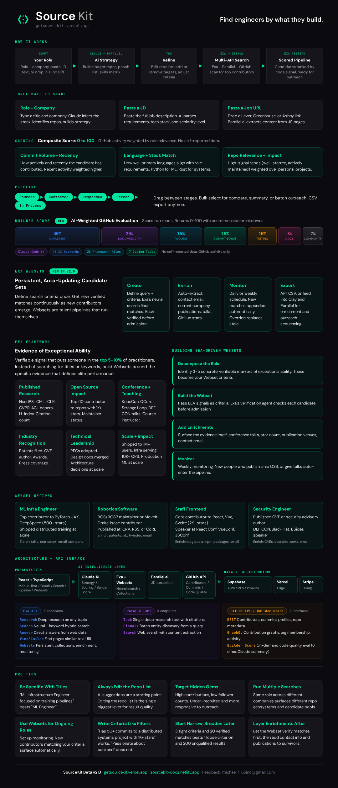

# SourceKit Beta v2.0

**Find engineers by what they build, not what they claim.**

SourceKit is a technical sourcing tool that finds software engineers through their actual code contributions, open-source activity, and verifiable technical output. No keyword matching. No LinkedIn scraping. No self-reported skills.

You give it a role (title + company, a JD, or a job URL). It returns a scored pipeline of engineers ranked by real GitHub activity, weighted against your role requirements.

---

## How It Works

1. **Input**: Role + company name, paste a full JD, or drop in a Lever/Greenhouse/Ashby URL
2. **AI Strategy**: Claude + Parallel.ai build a target repo list, poach list, and skills matrix from the JD
3. **Refine**: You edit the repo list, add/remove targets, adjust criteria (this is the single biggest lever for result quality)
4. **Multi-API Search**: Exa neural search + Parallel company intel + GitHub contributor scan run in parallel
5. **Scored Pipeline**: Candidates ranked by code signal, ready for outreach in a Kanban board

---

## What's New in v2.0

### Builder Score
AI-weighted GitHub code quality evaluation. Scans a candidate's top repositories and returns a 0-100 composite score with per-dimension breakdowns across 7 weighted dimensions:

| Dimension | Weight | What It Measures |
|-----------|--------|-----------------|
| AI Mastery | 30% | AI/ML framework usage, model files, AI keywords, Claude Code activity |
| Build Velocity | 20% | Commit frequency, recency, contribution consistency |
| Tooling | 15% | CI/CD configs, framework files, dev tool adoption |
| Commit Bonus | 15% | Code volume, language diversity, active coding tools |
| Testing | 10% | Test file coverage, testing framework usage |
| Documentation | 8% | README quality, docs directory, inline documentation |
| Community Health | 7% | Issues, PRs, contributor guidelines, community engagement |

No self-reported data. GitHub activity only. Each score includes a Claude-generated natural language summary explaining the signal.

### Exa Websets
Persistent, auto-updating candidate sets. Define search criteria once. Get new verified matches continuously as new contributors emerge.

- **Create**: Define query + criteria. Exa's neural search finds matches. Each candidate verified before admission.
- **Enrich**: Auto-extract contact email, current company, publications, conference talks, GitHub stats.
- **Monitor**: Daily or weekly schedule. New matches appended automatically.
- **Export**: API, CSV, or feed into Clay/Parallel for enrichment and outreach sequencing.

Websets are talent pipelines that run themselves.

---

## EEA Framework

Evidence of Exceptional Ability: verifiable signal that puts someone in the top 5-10% of practitioners. Instead of searching for titles or keywords, build Websets around specific evidence that defines elite performance.

**Artifact catalog**: Published research (NeurIPS, ICML, ICLR, CVPR), open-source impact (top-10 contributor to 1K+ star repos), conference talks (KubeCon, QCon, DEF CON), patents/CVEs, technical leadership (RFCs adopted, architecture at scale), and production impact (shipped to 1M+ users, 10K+ QPS infra).

---

## API Surface

### Exa API (5 endpoints)
- **Research**: Deep research on any topic
- **Search**: Neural + keyword hybrid search
- **Answer**: Direct answers from web data
- **findSimilar**: Find pages similar to a URL
- **Websets**: Persistent collections with enrichment and monitoring

### Parallel API (3 endpoints)
- **Task**: Single deep-research task with citations
- **FindAll**: Batch entity discovery from a query
- **Search**: Web search with content extraction

### GitHub API + Builder Score (3 interfaces)
- **REST**: Contributors, commits, profiles, repo metadata
- **GraphQL**: Contribution graphs, org membership, activity
- **Builder Score**: On-demand code quality eval (7 dimensions, Claude summary)

---

## Pipeline UI

Kanban board with 5 stages: Sourced, Contacted, Responded, Screen, In Process. Drag between stages. Bulk select for compare, summary, or batch outreach. CSV export anytime.

---

## Stack

React + TypeScript, Supabase (PostgreSQL + Edge Functions + RLS), Vercel, Stripe, Claude AI, Exa API + Websets, Parallel.ai, GitHub REST + GraphQL.

---

## Links

- **App**: [getsourcekit.vercel.app](https://getsourcekit.vercel.app)
- **Docs/Infographic**: [sourcekit-docs.netlify.app](https://sourcekit-docs.netlify.app)
- **Feedback**: michael.f.rubino@gmail.com

---

